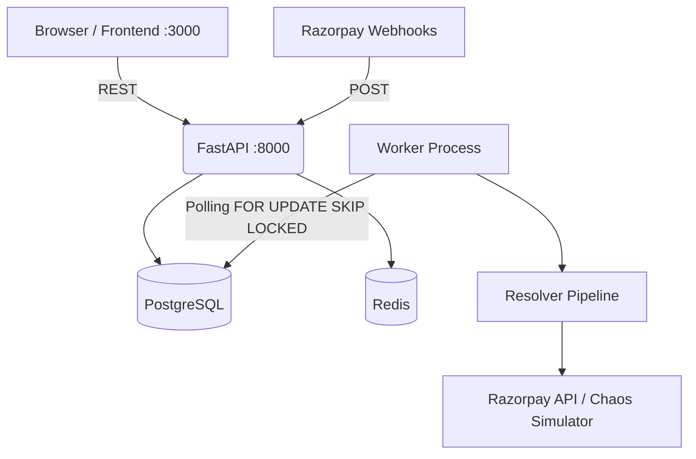

# ResolverAI — Forensic System Audit

## 1. Executive Verdict
ResolverAI is a **HYBRID** system. It possesses a genuinely robust, production-grade distributed systems backend (transactional outbox, PostgreSQL immutability, HMAC webhook verification, Redis idempotency) coupled with a completely **SIMULATED** AI layer. The "Agents" are currently deterministic Python functions masquerading as AI. The UI feels like a simulation because it heavily emphasizes synthetic fault injection (Chaos Lab) and "Demo Payments" rather than acting as a passive observer of a real merchant checkout flow. Architecturally, it is an excellent foundation for a Payment Integrity platform, but it is currently positioned more as an interactive technical demo than a ready-to-deploy SaaS.

## 2. Repository Inventory
- **app.py**: FastAPI application entry point. Registers routes and CORS. (Real, Production-Ready base).
- **api/webhook_receiver.py**: Handles Razorpay webhooks. Implements secure HMAC-SHA256 verification and outbox enqueuing. (Real, High Security, Production-Ready).
- **worker.py**: Background worker polling `outbox_events` using `FOR UPDATE SKIP LOCKED`. (Real, Production-Ready).
- **core/resolver.py**: The central orchestration pipeline linking the state machine, agents, policy engine, and finops. (Real execution, but relies on simulated AI).
- **core/state_machine.py**: 15-state deterministic state machine. (Real).
- **core/policy_engine.py**: The 5-rule safety gate. (Real, strictly enforced).
- **agents/detective.py**: "AI" agent. (SIMULATED - uses hardcoded deterministic rules, LLM is just a stub returning `None`).
- **agents/negotiator.py**: Evidence gatherer. (Hybrid - can hit real Razorpay API or local Chaos simulator).
- **agents/finops_executor.py**: Financial mutator. (Hybrid - executes real Razorpay capture/refunds or synthetic ones).
- **chaos_lab/simulator.py**: Local synthetic payment rail. (SIMULATION ONLY).
- **frontend/src/app/page.js**: Next.js dashboard. (Real data, but includes simulation triggers like "New Demo Payment").
- **schema.sql**: PostgreSQL schema with immutability triggers. (Real, High Quality).

## 3. Runtime Architecture

*This runtime architecture is accurately reflected in the code and `start_all.sh`.*

## 4. Actual Razorpay Integration
**IMPLEMENTED.** 
The system genuinely integrates with Razorpay via `razorpay/client.py`, `razorpay/payments.py`, and `razorpay/orders.py`. It uses `httpx` for async API calls. If `RAZORPAY_MODE` is set to `TEST` or `LIVE`, it will make actual network requests to `api.razorpay.com`. The webhook receiver securely validates genuine Razorpay webhook payloads using the `X-Razorpay-Signature`.

## 5. Webhook Forensics
1. **Endpoint**: `POST /webhook/razorpay`.
2. **Reading raw body**: Yes, `await request.body()` is used.
3. **HMAC Verification**: Yes, `hmac.new(sha256).hexdigest()` and `hmac.compare_digest` are used correctly in `razorpay/webhooks.py`.
4. **Deduplication**: Two-layer. Redis `is_event_processed` fast-path, and PostgreSQL `UNIQUE(source, external_event_id)` constraint.
5. **Persistence**: Immutable insert into `payment_events`, upsert into `payment_intents`, and insert into `outbox_events` in a single transaction.
6. **Async Processing**: Yes, webhook endpoint returns fast acknowledgment; heavy lifting is deferred to the Outbox worker.
7. **Failure Modes**: If Postgres is down, it 500s. If Redis is down, it fails (unless `core/idempotency.py` fallback is active, which was recently added).

## 6. Database Forensics
- **payment_events**: AUTHORITATIVE. Written by webhook receiver. Immutable (enforced by DB trigger).
- **payment_intents**: DERIVED operational state. Written by webhooks and resolver. Mutable.
- **external_executions**: AUTHORITATIVE log of mutation attempts.
- **outbox_events**: QUEUE. Managed by worker.
- **immutable_evidence**: AUTHORITATIVE audit trail. Immutable (enforced by DB trigger).
- **reconciliation_cases**: Incident management.
- **The "Three Truths"**: The codebase *actually enforces* this concept. Events are raw and immutable; Intents are operational state; Evidence is an immutable cryptographic-style log of decisions.

## 7. State Machine
**Transitions enforced deterministically in `core/state_machine.py`.**
- **TIMEOUT -> UNCERTAIN**: Explicitly enforced. A timeout never directly transitions to `FAILED`.
- **LATE_DUPLICATE**: `CAPTURED` -> `DUPLICATE_SUSPECTED`.
- **Terminal States**: `CAPTURED`, `RECONCILED`, `MANUAL_REVIEW`, `FAILED`.

## 8. AI Agent Forensics
1. **Is it genuinely AI?**: **NO.**
2. **Provider**: `GEMINI_API_KEY` and `GROQ_API_KEY` exist in config, but `_analyze_with_llm` in `agents/detective.py` is a stub returning `None`.
3. **Fallback**: It immediately falls back to `_deterministic_fallback` which uses hardcoded `if/else` rules based on rails (UPI vs Card) and state (`has_capture`).
4. **Output**: Structured via Pydantic (`DetectiveResult`).
5. **Verdict**: The multi-agent architecture exists as Python classes passing structured schemas to each other, but there is zero actual LLM decision-making happening. It is a deterministic rule engine pretending to be AI.

## 9. Agent Studio Verification
**NOT IMPLEMENTED.**
A complete repository scan for Razorpay Agent Studio, Anthropic, Claude SDK, or MCP reveals no actual integration. The system only mentions "AI" conceptually. There is no active agent orchestration via external Agent Studio APIs.

## 10. Simulation Forensics
The UI feels like a simulation because:
1. **"New Demo Payment" Button**: Directly injects synthetic intent state into the database from the dashboard rather than via a real checkout flow.
2. **Chaos Lab**: A dedicated page explicitly for injecting synthetic failures (Late Auth, Cross-Rail Duplicate).
3. **Synthetic Rail (`chaos_lab/simulator.py`)**: Has built-in, hardcoded mock delays and failure rates.
4. **Conclusion**: The frontend acts more as an interactive diagram of the backend's capabilities than a tool a merchant would log into to do their daily work. A real merchant dashboard displays data passively; it doesn't have a button to "inject an out-of-order webhook".

## 11. Frontend Forensics
- **/** (Dashboard): Fetches real DB stats, but includes synthetic injection buttons.
- **/payments**: Real data from PostgreSQL.
- **/payments/[id]**: Real timeline and evidence from PostgreSQL.
- **/chaos-lab**: Pure simulation trigger panel.
- **Production Value**: High visual quality, but the UX is designed for a hackathon judge (showing off fault tolerance) rather than a merchant (who just wants to see failed payments and fix them).

## 12. Real User Journeys
- **Webhook arrives late**: Works. Outbox worker processes it, Detective identifies late auth, Policy Engine approves capture, FinOps executes.
- **Duplicate webhook**: Works. Redis/Postgres drops the duplicate immediately; idempotency is rock solid.
- **Financial mutation**: Works. Policy gate strictly prevents execution without an approved `AuthorizedAction` token.

## 13. Security Audit
- **Webhook Auth**: CORRECT. Constant-time HMAC-SHA256 against raw bytes.
- **API Auth**: MISSING. Frontend has no authentication. Anyone accessing port 3000 has full admin access to trigger resolutions and view financial data.
- **SQL Injection**: MITIGATED. Uses parameterized queries via `asyncpg`.
- **Idempotency**: STRONG. Redis + Postgres unique constraints.

## 14. Financial Safety Audit
1. **No duplicate capture**: IMPLEMENTED. Policy Rule 4 and `has_existing_capture` check.
2. **Amount matching**: IMPLEMENTED. Policy Rule 3 strictly checks intent amount vs external API amount.
3. **Idempotent mutation**: IMPLEMENTED. FinOps executor passes `idempotency_key` to Razorpay.
4. **No AI direct financial authority**: IMPLEMENTED. The FinOps executor *only* accepts `AuthorizedAction` typed objects from the Policy Engine.

## 15. Outbox & Worker Audit
- **Implementation**: PostgreSQL-based.
- **Locking**: Uses `SELECT ... FOR UPDATE SKIP LOCKED`. Highly robust and prevents concurrent worker collisions.
- **Semantics**: At-least-once delivery. If worker crashes after FinOps execution but before DB update, the transaction rolls back, and the event remains `PENDING`. Upon retry, idempotency keys prevent double-charging on Razorpay.

## 16. Failure Mode Analysis
1. **ResolverAI crashes after webhook receipt**: Safe. Webhook is persisted, `outbox_events` is pending. Worker resumes on reboot.
2. **Worker crashes immediately before Razorpay capture**: Safe. Event remains pending, will be retried.
3. **Worker crashes immediately after Razorpay capture**: Safe. Transaction rolls back. On retry, Razorpay API rejects the duplicate idempotency key, Negotiator sees `CAPTURED` state, and Policy Engine transitions state locally without re-capturing.
4. **Duplicate Webhook**: Safe. Blocked by `payment_events` unique constraint.

## 17. Production Gap Analysis
- **Missing**: Merchant Authentication (JWT/OAuth).
- **Missing**: Real AI Agent Studio Integration (currently faked).
- **Missing**: A real shopping cart frontend to demonstrate end-to-end flow without hitting a "Demo" button.
- **Missing**: Multi-tenant isolation (merchant_id is hardcoded to `default_merchant`).

## 18. Actual Problem Being Solved
A. **One sentence**: ResolverAI acts as a fault-tolerant buffer that safely auto-reconciles ambiguous payment states (like timeouts and late webhooks) without double-charging the customer.
B. **Is this a REAL problem?**: **YES**. Drop-offs and phantom failures due to UPI timeouts or webhook delays cause massive support overhead and revenue leakage for large Indian merchants.

## 19. Why It Looks Like a Simulation
Because the product is currently presenting itself as a **Test Laboratory** rather than a **Production Dashboard**. A real dashboard observes; this dashboard generates. To look real, it needs to be hooked up to a dummy e-commerce storefront (e.g., selling a T-shirt), where the user makes a real Razorpay Test payment, and *then* the dashboard passively reacts to the webhooks.

## 20. Minimum Real Product
**Payment Integrity Control Plane**
- Remove the "Demo" buttons from the dashboard.
- Connect a separate, simple T-Shirt store UI using the real Razorpay Checkout widget.
- Integrate the real Claude/Agent Studio SDK in `detective.py` so the AI actually reads the JSON payload and outputs a hypothesis.

## 21. Demo vs Product
- **Demo Capabilities**: Excellent visual explanation of state machines, policy gates, and outbox patterns. The Chaos Lab effectively demonstrates fault tolerance.
- **Product Capabilities**: The webhook receiver, outbox worker, and database schema are genuinely production-grade and could be deployed tomorrow with minimal changes.

## 22. Safe Claims
- **SAFE**: "We use a transactional outbox pattern to guarantee zero dropped webhooks."
- **SAFE**: "We use constant-time HMAC-SHA256 to securely verify Razorpay webhooks."
- **SAFE**: "Our policy engine deterministically prevents duplicate captures."
- **MUST NOT MAKE**: "We use Agent Studio." (It is not in the code).
- **MUST NOT MAKE**: "Our AI resolves payments." (The rules are hardcoded `if/else` statements).

## 23. API Contract Map
| Method | Endpoint | Purpose | Frontend Caller | DB Effect | Razorpay Effect | Auth | Real/Simulated |
|--------|----------|---------|-----------------|-----------|-----------------|------|----------------|
| POST | `/webhook/razorpay` | Ingest Webhook | N/A (Razorpay) | Insert/Upsert | None | HMAC | Real |
| GET | `/dashboard/stats` | KPIs | Dashboard | Read | None | None | Real |
| POST | `/demo/inject` | Trigger Chaos | Chaos Lab | Insert/Upsert | None | None | Simulated |
| GET | `/payments/{id}` | Read Intent | Payments UI | Read | None | None | Real |
| POST | `/cases/{id}/resolve` | Manual Action | Cases UI | Update | None | None | Real |

## 24. Environment Map
- `DATABASE_URL`: Postgres connection (REQUIRED, SECRET)
- `REDIS_URL`: Redis connection (REQUIRED)
- `RAZORPAY_KEY_ID`: Razorpay Auth (REQUIRED for Real Mode)
- `RAZORPAY_KEY_SECRET`: Razorpay Auth (REQUIRED, SECRET)
- `RAZORPAY_WEBHOOK_SECRET`: HMAC Validation (REQUIRED, SECRET)
- `AI_MODE`: "DETERMINISTIC" vs "ENABLED" (Currently has no real effect due to stub)
- `GEMINI_API_KEY`: Stubbed
- `GROQ_API_KEY`: Stubbed

## 25. Architecture Diagrams
*(Refer to Section 3 for Runtime Architecture)*

## 26. Scorecard
- **Real-world usefulness**: 9/10 (The core problem is very real).
- **Real Razorpay integration**: 8/10 (APIs and Webhooks are implemented correctly).
- **Reliability/Safety**: 10/10 (Outbox + Idempotency + 5-Rule Gate is superb).
- **Security**: 7/10 (Missing dashboard auth, but great backend auth).
- **AI implementation**: 0/10 (Completely faked).
- **TOTAL**: **6.8/10** (Pulled down heavily by the lack of real AI in an AI Buildathon).

## 27. THE TRUTH ABOUT RESOLVERAI
1. **Is it a simulation?**: It is a hybrid. The infrastructure is real, the AI is a simulation.
2. **Does it solve a real problem?**: Yes.
3. **What is the strongest capability?**: The deterministic safety architecture (Outbox + Policy Gate).
4. **What is the biggest credibility problem?**: Claiming to be an AI platform when `detective.py` is literally a hardcoded `if/else` block and Agent Studio is not integrated.
5. **What we should tell the judges**: Be transparent. Pitch the *Architecture*. Say: "We spent our time building a mathematically safe, fault-tolerant financial control plane. The AI currently uses basic deterministic fallbacks for safety, but the architecture is fully prepared to plug into Agent Studio as the advisory intelligence layer."

## 28. Recommended Next Architecture
*(Analysis Only)*
Integrate the official Razorpay Agent Studio SDK. Replace the `if/else` logic in `detective.py` with an actual LLM prompt that receives the payment JSON and outputs a Pydantic `DetectiveResult`.

## 29. Exact Next Implementation Plan
*(Analysis Only)*
1. Install `anthropic` or Razorpay Agent Studio SDK.
2. Update `_analyze_with_llm` in `detective.py` to make a real network call.
3. Remove the "Demo Payment" button and replace it with a separate `checkout.html` simulating a real merchant storefront.
